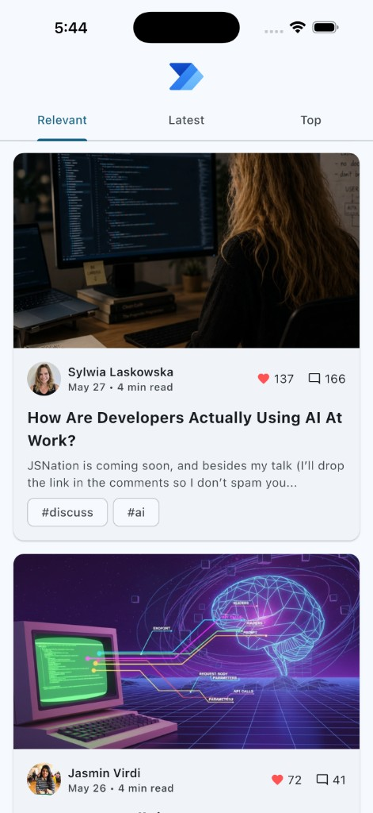
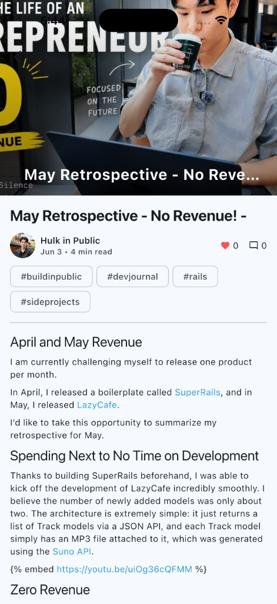
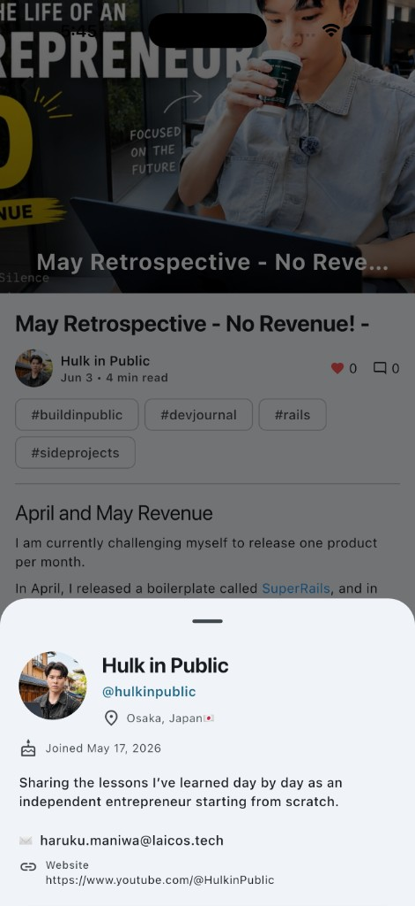

# DevTo Flutter

A cross-platform Dev.to reader built with Flutter.

## Screenshots

| Feed | Article | Author profile |
| --- | --- | --- |
|  |  |  |

- **Feed** — Browse articles with Relevant, Latest, and Top tabs, cover images, tags, and engagement counts.
- **Article** — Read full posts with cover art, metadata, tags, and rendered HTML body content.
- **Author profile** — Tap an author to open a bottom sheet with bio, location, join date, email, and links.

## Features

- Browse trending and latest Dev.to articles
- View article details and metadata
- Explore articles grouped by authors
- Clean and responsive mobile UI
- Cross-platform support with Flutter

## Tech Stack

- Flutter
- Dart
- Dev.to API

## Getting Started

```bash
cd v2/devto_blog
flutter pub get
flutter run
```
